# Lung Disease Classification

A deep learning pipeline for classifying lung diseases from chest X-ray images. The system combines lung segmentation, multi-model classification, and Firefly-based feature selection to identify four conditions: COVID-19, Lung Opacity, Normal, and Viral Pneumonia.

---

## Overview

The pipeline runs in two major phases:

**Phase 1 — Framework (CNN Training)**
Raw X-rays are segmented, then three CNN classifiers are trained and compared: VGG16, ResNet50, and ConvNeXt-Tiny (the proposed model).

**Phase 2 — Firefly (Feature Selection)**
Features extracted from the trained CNNs are passed through a Firefly optimization algorithm to select the most useful subset, which is then evaluated using MLP and SVM classifiers.

---

## Pipeline Flow

```
X-ray Image
    |
    v
[Attention U-Net Segmentation]   <-- trained on lung masks
    |
    v
Segmented Lung Mask
    |
    v
[6-Channel Input]  (original RGB + masked RGB stacked)
    |
    v
CNN Classifier Training
    |-- VGG16
    |-- ResNet50
    |-- ConvNeXt-Tiny  (proposed)
    |
    v
Evaluation: Accuracy, F1, ROC-AUC, Confusion Matrix, Grad-CAM
    |
    v
[Feature Extraction from frozen CNN backbone]
    |
    v
[Firefly Algorithm — feature selection]
    |-- MLP evaluation path
    |-- SVM evaluation path
    |
    v
Final Classifier (MLP or SVM on selected features)
    |
    v
5-Fold Cross-Validation + Final Metrics
```

---

## Architecture

### Segmentation — Attention U-Net

An encoder-decoder network with skip connections and attention gates. Takes a 3-channel X-ray image and outputs a binary lung mask. The mask is used to isolate lung regions before classification.

### Classification — 6-Channel CNN Input

All three classifiers accept a 6-channel input: the original 3-channel RGB image concatenated with the 3-channel masked image. This forces the model to learn from both the full image and the lung region together.

- **VGG16**: Standard VGG architecture with a modified head for 4-class output. First conv layer expanded to accept 6 channels.
- **ResNet50**: ResNet with the same 6-channel modification. Output layer replaced with a 4-class linear head.
- **ConvNeXt-Tiny** (proposed): A modern ConvNet with a patch-based stem. First conv replaced to accept 6 channels. Global average pooling followed by LayerNorm and a linear classifier head.

### Feature Selection — Firefly Algorithm

After training, the CNN backbone is frozen. Features (768-dim for ConvNeXt-Tiny) are extracted from the full dataset. The Firefly Algorithm then searches for a binary mask over these features that maximizes classifier accuracy. Each "firefly" represents a candidate feature subset, and fireflies move toward brighter (higher-accuracy) solutions over iterations.

Two evaluation paths are supported:
- **MLP**: A fully connected network trained on selected features.
- **SVM**: A linear kernel SVM trained on selected features.

---

## File Structure

```
├── main_framework.py           # Train and evaluate all 3 CNN classifiers
├── main_framework_firefly.py   # Load trained CNNs, run Firefly feature selection
├── main_classifier.py          # Standalone classifier training entry point
├── main_firefly.py             # Standalone Firefly entry point
├── main_unet.py                # Segmentation training entry point
├── mask_create.py              # Generate segmented masks from trained U-Net
├── model_run.py                # Inference on new images
├── valid_classifier.py         # Validate trained classifier
├── valid_segment.py            # Validate segmentation model
│
├── models/
│   ├── classifier.py           # ConvNeXt, VGG16, ResNet50, MLP, BetterMLP
│   └── unet.py                 # Attention U-Net
│
├── train/
│   ├── firefly.py              # Firefly feature selection (MLP + SVM versions)
│   ├── train_classifier.py     # CNN training loop
│   ├── train_unet.py           # U-Net training loop
│   └── loss.py                 # Loss functions
│
├── preprocess/
│   ├── preprocess.py           # Mask generation from model or existing masks
│   └── feature.py              # Feature extraction utilities
│
└── utils/
    ├── dataloader.py           # Dataset loading
    ├── data_create.py          # Train/val split, dataset class
    ├── cross_validation.py     # 5-fold CV
    ├── gradcam.py              # Grad-CAM implementation
    ├── metrics.py              # Accuracy, F1, ROC, confusion matrix
    └── tools.py                # General utilities
```

---

## Dataset Structure

```
dataset/
├── COVID/
│   ├── images/
│   └── masks/
├── Lung_Opacity/
│   ├── images/
│   └── masks/
├── Normal/
│   ├── images/
│   └── masks/
└── Viral Pneumonia/
    ├── images/
    └── masks/
```

Mask filenames must match their corresponding image filenames exactly.

The dataset used is the [COVID-19 Radiography Dataset](https://www.kaggle.com/datasets/tawsifurrahman/covid19-radiography-database) from Kaggle.

---

## Running the Pipeline

### Step 1 — Train the Segmentation Model

```bash
python main_unet.py
```

Update `images_dir = ""` with your dataset path before running.

### Step 2 — Generate Segmented Masks

```bash
python mask_create.py
```

Set `pretrained_model_path` and `data_dir` in the file. If you already have masks in the dataset folder, pass `model=None` to use them directly.

### Step 3 — Train and Compare CNN Classifiers

```bash
python main_framework.py
```

Set `DATASET_PATH` and `OUTPUT_DIR` in the CONFIG section. This trains all three models, evaluates them, generates confusion matrices, ROC curves, training curves, Grad-CAM visualizations, and runs 5-fold cross-validation on ConvNeXt-Tiny.

### Step 4 — Firefly Feature Selection

```bash
python main_framework_firefly.py
```

Set `DATASET_PATH`, `OUTPUT_DIR`, and `WEIGHT_PATHS` (paths to `.pth` files from Step 3). Choose `FIREFLY_CLASSIFIER = "MLP"`, `"SVM"`, or `"both"`.

### Step 5 — Run Inference

```bash
python model_run.py
```

Set `SEG_MODEL_PATH`, `CLS_MODEL_PATH`, and `INPUT_PATH` (single image or folder). Results are saved in `inference_results/`.

---

## Segmentation Results

Sample outputs from the Attention U-Net — each image shows the original X-ray alongside the predicted lung mask.

| Sample 0 | Sample 1 |
|----------|----------|
| 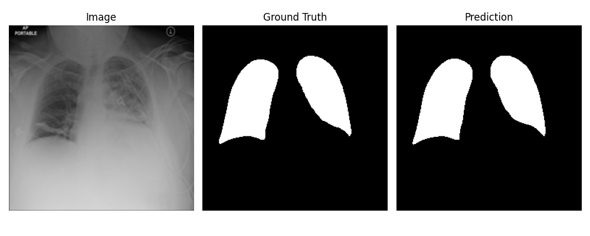 | 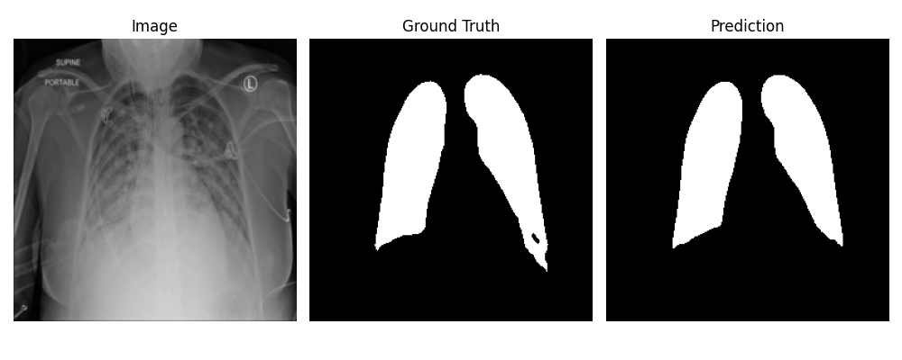 |

---

## Classification Results

### Training Curves

| VGG16 | ResNet50 | ConvNeXt-Tiny |
|-------|----------|---------------|
| 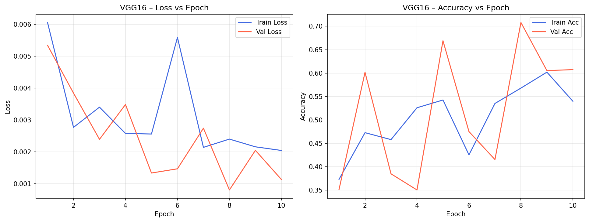 | 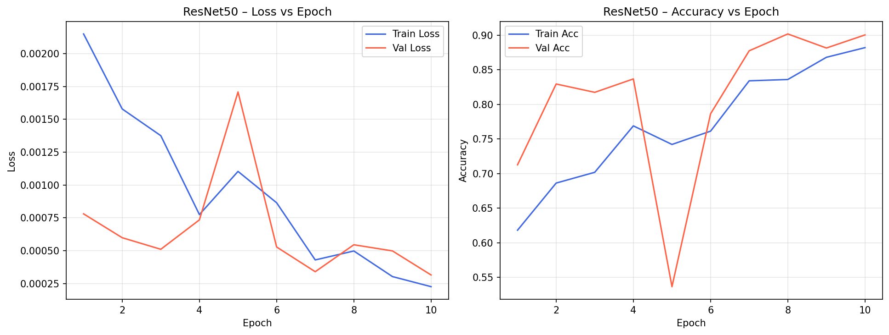 | 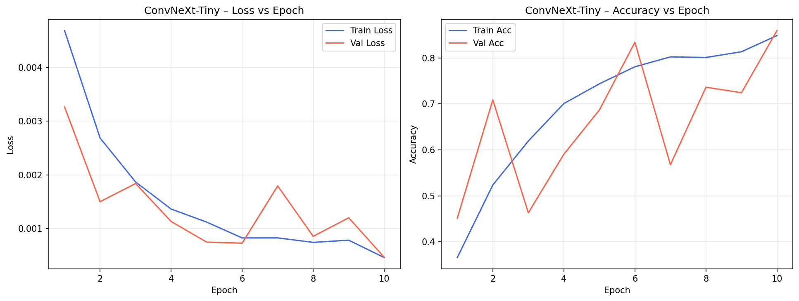 |

### Confusion Matrices

| VGG16 | ResNet50 | ConvNeXt-Tiny |
|-------|----------|---------------|
| 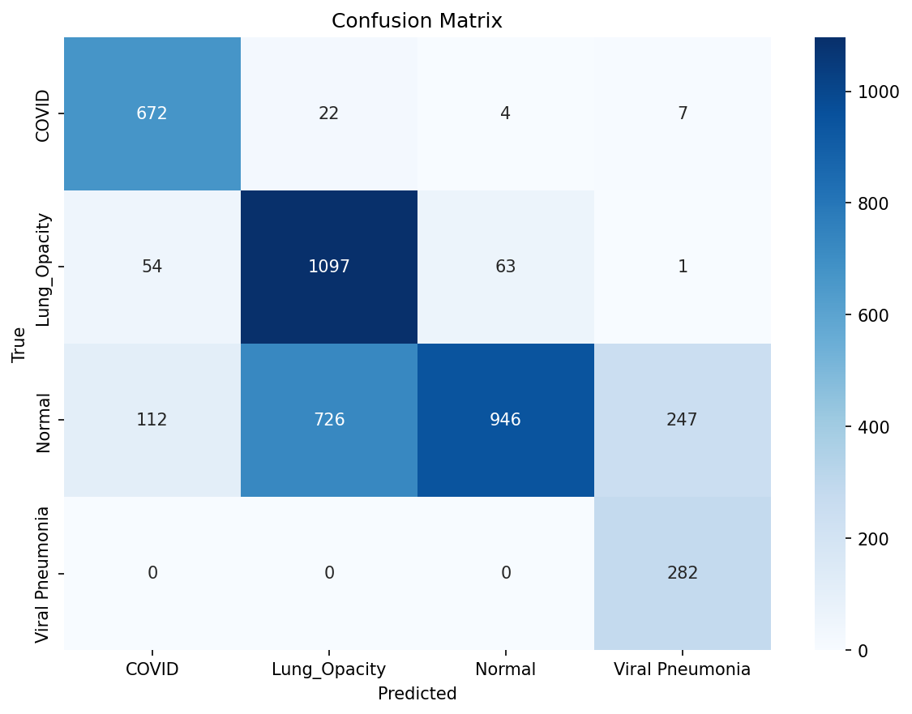 | 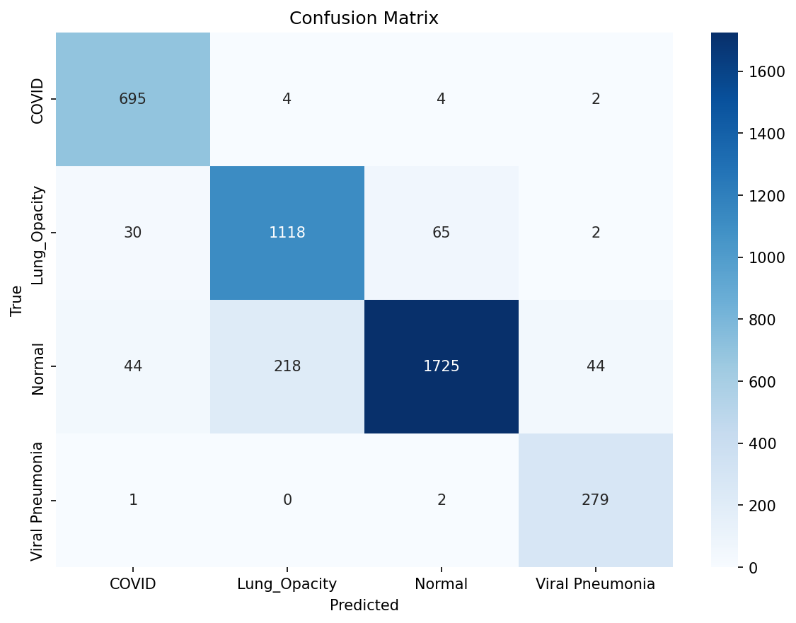 |  |

### ROC Curves

| VGG16 | ResNet50 | ConvNeXt-Tiny |
|-------|----------|---------------|
| 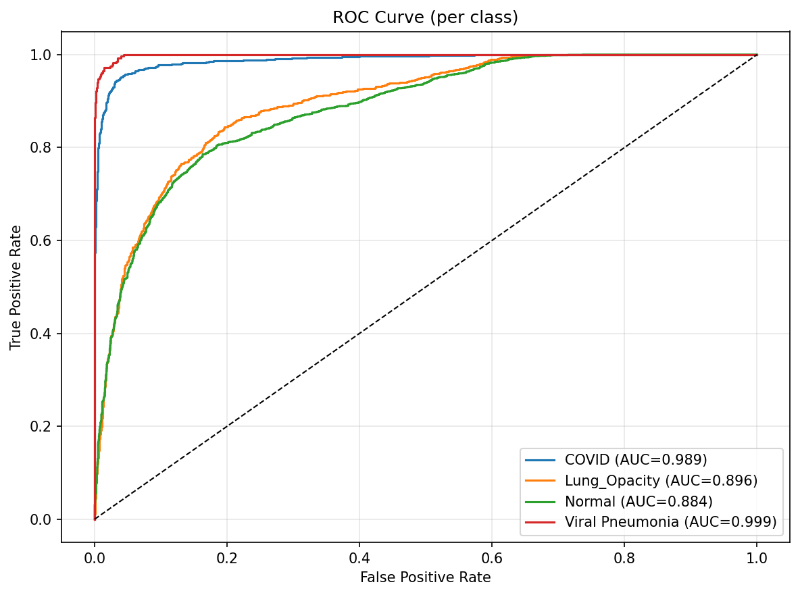 | 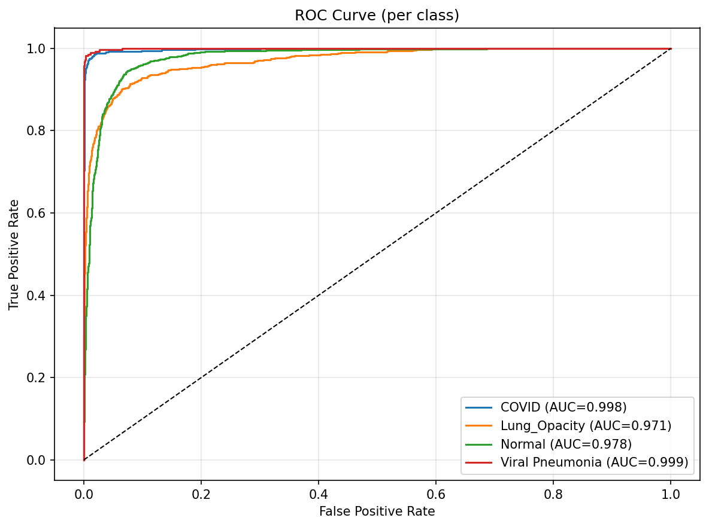 | 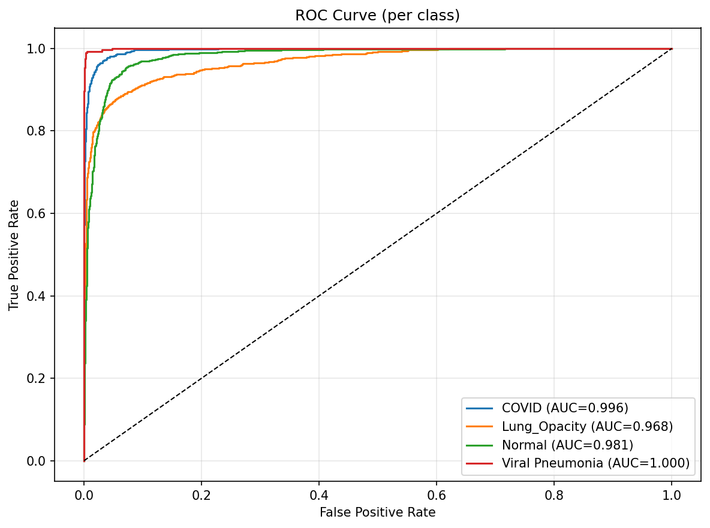 |

---

## Grad-CAM Visualizations (ConvNeXt-Tiny)

Grad-CAM highlights the regions the model focuses on when making a prediction. These are generated on the validation set using the best-performing model.

| COVID | Lung Opacity | Normal | Viral Pneumonia |
|-------|--------------|--------|-----------------|
| 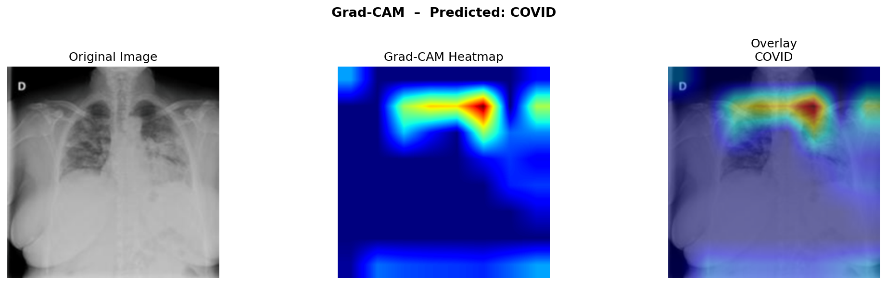 | 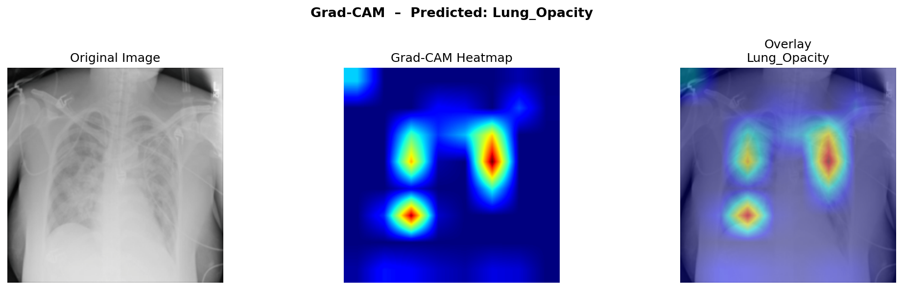 | 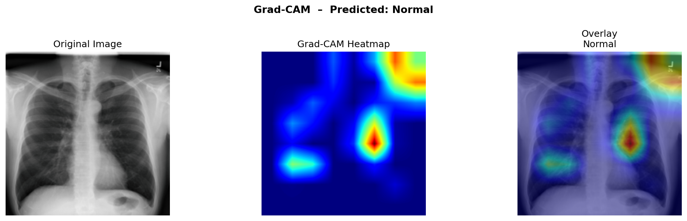 |  |

---

## Firefly Results (ConvNeXt-Tiny Backbone)

The Firefly algorithm reduces the 768 ConvNeXt-Tiny features to a smaller subset before classification.

| Configuration | Features Selected | Accuracy | F1 Score | ROC-AUC |
|---------------|-------------------|----------|----------|---------|
| ConvNeXt-Tiny + MLP | 398 / 768 | 92.0% | 0.9185 | 0.9854 |
| ConvNeXt-Tiny + SVM | 379 / 768 | 93.5% | 0.9346 | 0.9880 |

5-Fold Cross-Validation:

| Configuration | CV Accuracy | CV F1 | CV ROC-AUC |
|---------------|-------------|-------|------------|
| ConvNeXt-Tiny + MLP | 92.9% ± 0.6% | 0.9286 | 0.9868 |
| ConvNeXt-Tiny + SVM | 94.1% ± 0.2% | 0.9410 | 0.9890 |

---

## Inference Samples

Sample outputs from `model_run.py`. Each image shows the predicted class and confidence score.

| COVID (97%) | Lung Opacity (97%) | Normal (99.2%) | Viral Pneumonia (91%) |
|-------------|-------------------|----------------|-----------------------|
| 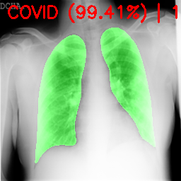 | 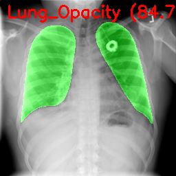 | 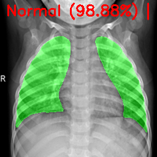 |  |

---

## Metrics Explained

**Segmentation**
- Dice Coefficient: overlap between predicted and ground-truth mask
- IoU: intersection over union
- Pixel Accuracy: percentage of correctly classified pixels

**Classification**
- Accuracy: overall correct predictions
- Precision / Recall / F1: per-class and weighted averages
- Specificity: true negative rate
- ROC-AUC: area under the receiver operating characteristic curve
- Inference Time: milliseconds per image

---

## Requirements

```
Python 3.10+
torch
torchvision
numpy
opencv-python
scikit-learn
matplotlib
tqdm
joblib
psutil
Pillow
```

Install with:

```bash
pip install torch torchvision numpy opencv-python scikit-learn matplotlib tqdm joblib psutil Pillow
```

---

## Key Configuration Variables

| File | Variable | Purpose |
|------|----------|---------|
| `main_framework.py` | `DATASET_PATH` | Path to dataset root |
| `main_framework.py` | `NUM_EPOCHS` | Training epochs (default 10) |
| `main_framework.py` | `BATCH_SIZE` | Batch size (default 8) |
| `main_framework_firefly.py` | `WEIGHT_PATHS` | Paths to trained `.pth` files |
| `main_framework_firefly.py` | `FIREFLY_CLASSIFIER` | `"MLP"`, `"SVM"`, or `"both"` |
| `main_framework_firefly.py` | `FIREFLY_N_FIREFLIES` | Number of fireflies (default 15) |
| `model_run.py` | `SEG_MODEL_PATH` | Path to U-Net weights |
| `model_run.py` | `CLS_MODEL_PATH` | Path to classifier weights |
| `model_run.py` | `INPUT_PATH` | Image or folder to run inference on |
---
Made with ❤️ by NiceGuy
